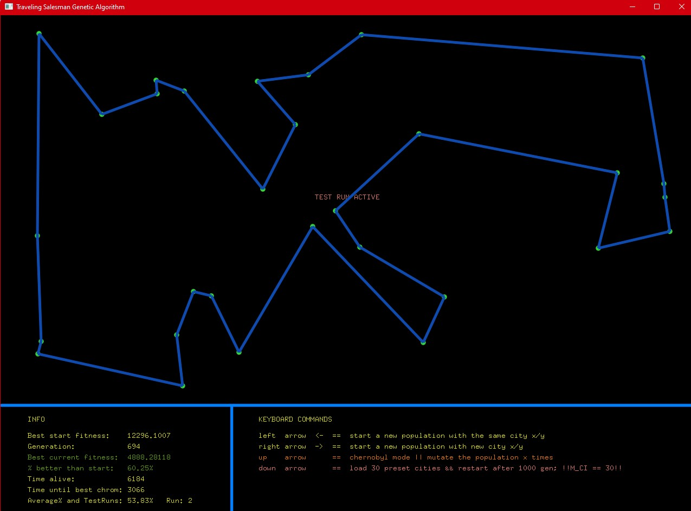

# A Genetics Algorithm(GA) for solving the Traveling Salesman Problem(TSP)

## Picture(s) of software:

## Release 1.3 Download Link
- https://github.com/lucasnordic/Genetics-Project-in-AI-Course/releases/tag/Release_1.3

## Tutorial
- The yellow dots are cities
- The blue lines symbolize shortest path found by the algorithm
- Keyboard commands are left-, right-, up- and down arrow

## Links
- Made by using graphics rendering - GLUT (OpenGL):
https://www.opengl.org/resources/libraries/glut/
- Solves TSP - Travelling Salesman Problem: https://en.wikipedia.org/wiki/Travelling_salesman_problem